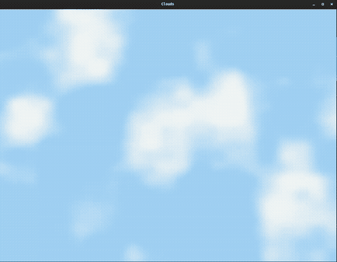

# Clouds with OpenGL and GLFW

## Description
This program showcases a dynamic cloud rendering using OpenGL and GLFW. The cloud effect is generated using a combination of procedural noise functions in the fragment shader.

## Demo



## Prerequisites
Before compiling the program, ensure you've installed the necessary dependencies:

- OpenGL libraries
- GLEW
- GLFW

## Compile

```bash
   git clone https://github.com/michaelknap/basic-cloud-shader-example.git
   cd basic-cloud-shader-example
   make
   ./build/clouds
```

## License

This project is licensed under the [MIT License](LICENSE).